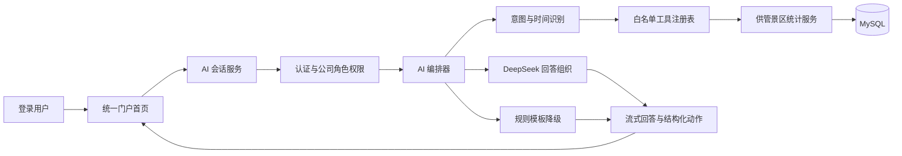

# 统一门户与全局 AI 助手一期设计

日期：2026-08-05

## 1. 背景

当前平台已经具备 Vue 3 + Vite + Element Plus 前端、FastAPI + SQLAlchemy + MySQL 后端，以及 DeepSeek 驱动的经营诊断、合同审查、附件校对和客户尽调能力。这些 AI 能力分散在各业务页面中，尚未形成统一入口，也不具备统一会话、权限感知的数据查询和安全的页面导航能力。

平台未来将承载山东出版投资有限公司、山东出版供应链管理有限公司、山东出版股权基金管理有限公司三个业务分系统，并逐步建设投资管理、法务风控等模块。因此一期先建立统一门户和 AI 助手基础能力，将现有供管分系统纳入统一路由与权限框架，为后续分系统接入保留稳定边界。

## 2. 一期目标

一期交付以下能力：

1. 登录后的首页改为“山东出版投资有限公司工作平台”统一门户。
2. 首页上半部分提供独立 AI 工作区，下半部分提供三个业务系统入口。
3. 将现有供管分系统迁移到 `/supplymanagement` 路由空间，并兼容旧地址。
4. 为 `/investment` 和 `/fundmanagement` 提供统一风格的“建设中”页面。
5. AI 支持平台介绍、供管景区聚合数据问答、趋势与对比分析，以及用户确认后的景区页面跳转。
6. AI 的数据访问继承现有公司、角色和资源权限，不形成权限旁路。
7. 持久化完整会话，提供用户历史记录和信息维护员审计能力。
8. DeepSeek 不可用时，平台介绍、景区查数和景区导航仍可通过规则模板工作。

## 3. 非目标

一期不包含以下内容：

- 不建设投资管理和基金管理的实际业务页面。
- 不建设新的法务风控业务模块。
- 不让 AI 修改配置、导入台账、删除业务记录、发起审批或执行其他业务写操作。
- 不允许模型直接生成或执行 SQL。
- 不向 AI 提供原始台账行、附件正文、账号凭证或系统密钥。
- 不开放任意 URL 跳转，不允许模型自行构造前端路由。
- 不建设第二个云模型作为故障备份。
- 不在一期重写现有审批中心为通用流程引擎；一期只确定后续分系统接入统一流程的接口边界。
- 不提供 AI 会话审计导出。

## 4. 已确认的关键决策

| 主题 | 决策 |
| --- | --- |
| 平台名称 | 山东出版投资有限公司工作平台 |
| 登录后首页 | `/`，上方 AI 工作区，下方业务系统入口 |
| AI 交互 | 独立工作台，多会话模式 |
| 投资公司路由 | `/investment`，一期显示建设中 |
| 供管公司路由 | `/supplymanagement`，承载当前完整供管分系统 |
| 基金公司路由 | `/fundmanagement`，一期显示建设中 |
| 权限模型 | 公司 + 角色 + 资源权限 |
| AI 数据范围 | 供管景区聚合与趋势数据，不含原始台账和附件 |
| AI 操作边界 | 一期严格只读 |
| 页面导航 | 回答附带可点击动作，用户点击后跳转，不自动跳转 |
| 时间问法 | 支持本月、上月、今年、去年、最近三个月等相对时间 |
| 回答标注 | 固定显示实际数据范围和更新时间 |
| 输出方式 | 流式输出，可停止生成 |
| 推荐问题 | 新会话展示，并按权限过滤 |
| 会话留存 | 可配置，默认 180 天 |
| 管理角色 | 信息维护员同时是超级管理员，是同一个角色和账号身份 |
| 模型故障 | 核心场景规则降级，通用问答提示服务不可用 |

## 5. 信息架构与路由

### 5.1 门户路由

- `/`：统一门户首页。
- `/investment`：山东出版投资有限公司建设中页面。
- `/supplymanagement`：山东出版供应链管理有限公司供管分系统首页。
- `/supplymanagement/*`：当前供管分系统的全部业务页面。
- `/fundmanagement`：山东出版股权基金管理有限公司建设中页面。
- `/login`：沿用现有登录页面。

### 5.2 供管路由迁移

当前供管页面统一增加 `/supplymanagement` 前缀。例如：

- `/cultural-tourism` 迁移为 `/supplymanagement/cultural-tourism`。
- `/cultural-tourism/:scenicId` 迁移为 `/supplymanagement/cultural-tourism/:scenicId`。

所有旧路由保留兼容重定向，并完整保留动态参数和查询参数。浏览器收藏、历史链接和已有站内跳转不能因迁移失效。

### 5.3 全局导航

门户和供管分系统共用统一顶部区域。供管分系统内始终保留“AI 助手”入口，点击后返回 `/` 并恢复用户最近打开的会话。投资和基金占位页也使用同一门户顶部区域。

## 6. 首页布局与交互

### 6.1 页面结构

首页明确分为上下两个独立区域：

1. 上方为 AI 智能助手区域，内部包含会话列表和对话区。
2. 下方为业务系统区域，独立展示三个公司链接框，不嵌入 AI 对话框。

桌面端 AI 区域使用稳定高度并在消息区内部滚动，使业务系统区域在常见桌面视口中保持可发现。移动端会话列表收入抽屉，AI 区域和业务系统链接框改为单列。

### 6.2 AI 会话

- 用户可以新建多个独立会话。
- 首轮问题完成后自动生成会话标题。
- 用户可以继续、重命名和删除自己的会话。
- 返回首页时恢复最近打开的会话和滚动位置。
- 新会话展示可点击的推荐问题，推荐内容按当前权限过滤。
- 回答采用流式输出，生成期间提供“停止生成”按钮。
- 生成期间阻止同一会话重复提交，但允许用户切换查看其他已完成会话。

### 6.3 业务系统入口

三个公司入口始终展示：

| 公司 | 路由 | 一期状态 |
| --- | --- | --- |
| 山东出版投资有限公司 | `/investment` | 建设中 |
| 山东出版供应链管理有限公司 | `/supplymanagement` | 已上线 |
| 山东出版股权基金管理有限公司 | `/fundmanagement` | 建设中 |

入口状态由后端门户接口返回。接口始终返回三个系统，不按权限隐藏系统。用户有权访问时可进入；没有权限时卡片置灰并显示“暂无访问权限”。建设中的系统始终显示“建设中”，即使用户拥有公司权限也不进入未完成业务页面；无权限用户同时显示不可访问状态。

## 7. AI 功能边界

### 7.1 一期支持的意图

1. 平台用途和功能介绍。
2. 三家公司及分系统状态介绍。
3. 指定景区在指定时间范围内的经营指标汇总。
4. 指定景区的月度或平台趋势。
5. 两个或多个有权访问景区的同口径对比。
6. 门票、酒店、平台和月份维度的聚合查询。
7. 生成经过校验的景区页面导航动作。
8. 当前模型能力范围内的通用只读问答。

投资和基金分系统一期只能回答定位、入口和建设状态。用户查询这两个分系统的业务数据时，统一提示“对应分系统建设中，暂无可查询数据”。

### 7.2 景区数据范围

白名单景区工具只允许查询以下聚合指标：

- 销售额。
- 核销数量。
- 投资规模。
- 实现规模。
- 毛利。
- 资金占用。
- 门票与酒店汇总。
- 平台汇总。
- 月度汇总与趋势。

AI 不返回原始台账行，不读取附件内容，不暴露内部数据库结构、内部计算公式或配置实现细节。

### 7.3 时间范围

系统支持明确日期和以下相对时间：

- 本月、上月。
- 今年、去年。
- 最近 N 个月。
- 指定月份、季度或年度。

相对时间以服务端 `Asia/Shanghai` 时区和请求发生时间换算。每个数据回答都显示换算后的实际起止日期、数据更新时间和必要的统计口径。不存在完整数据时必须说明数据覆盖范围，不能将部分月份描述为完整月份。

## 8. 总体架构

一期采用“AI 编排器 + 白名单业务工具”，不采用模型直连数据库。



### 8.1 前端

- 统一门户壳层负责平台名称、全局导航、用户信息和分系统入口。
- AI 首页负责会话列表、流式消息、推荐问题、停止生成和结构化动作渲染。
- 供管分系统继续使用现有业务组件，但路由统一置于 `/supplymanagement` 下。
- 前端只渲染后端返回的权限结果，不把菜单隐藏作为安全控制。

### 8.2 后端

新增以下服务边界：

- 门户应用注册服务：返回三个系统的名称、状态、路由和当前用户访问结果。
- AI 会话服务：维护会话、消息、标题、删除和留存。
- AI 编排器：识别意图、解析时间、选择工具、组织回答和执行降级。
- AI 工具注册表：只注册经过审查的只读业务工具。
- 景区统计服务：统一现有页面与 AI 的指标口径，避免 AI 重复实现统计逻辑。
- AI 审计服务：记录权限判定、工具调用、生成结果、删除和清理事件。

### 8.3 DeepSeek 使用原则

- 复用现有 DeepSeek 客户端、配置和超时机制。
- 模型只接收完成回答所需的结构化聚合结果。
- 模型不接收数据库连接信息、SQL、用户令牌、原始台账或附件。
- 模型只负责意图辅助识别和自然语言组织，权限与工具执行由确定性后端代码控制。
- 一期不接入第二个云模型。

## 9. 白名单工具

一期工具注册表至少包含：

| 工具 | 用途 | 主要约束 |
| --- | --- | --- |
| `get_platform_overview` | 介绍平台与三个分系统 | 使用受控平台说明，不访问业务数据 |
| `get_portal_applications` | 返回三个系统、建设状态和访问状态 | 始终返回三项，按权限设置 `accessible`，不隐藏系统 |
| `get_scenic_summary` | 查询景区聚合指标 | 必须指定授权景区和实际日期范围 |
| `get_scenic_trend` | 查询景区月度或平台趋势 | 只返回聚合序列 |
| `compare_scenics` | 同口径比较多个景区 | 所有景区均需通过权限校验 |
| `create_scenic_navigation_action` | 生成景区跳转动作 | 只返回已存在且有权访问的 `scenic_id` |

每个工具使用严格的请求与响应模型。未知字段、越界日期、无效景区、未授权公司或超出最大查询跨度时直接拒绝。模型不能动态注册新工具。

## 10. 请求数据流

1. 用户提交问题，后端验证登录状态并创建用户消息。
2. 会话服务加载用户的公司、角色和资源权限快照。
3. 编排器识别意图，并将相对时间转换为实际日期范围。
4. 权限层判断是否允许调用目标工具。未授权请求在任何业务数据进入模型前终止。
5. 工具调用统一景区统计服务并返回结构化聚合结果。
6. 编排器将最小必要结果交给 DeepSeek组织回答，或在模型不可用时交给规则模板。
7. 服务端流式返回文本增量、数据范围、更新时间和经过校验的结构化动作。
8. 前端完成显示。用户点击跳转动作后，前端根据动作类型和 `scenic_id` 映射到供管路由。
9. 会话服务保存最终消息状态，审计服务记录工具、权限、耗时和结果状态。

## 11. 结构化导航动作

模型不得返回可直接执行的任意 URL。后端响应动作采用受控结构，例如：

```json
{
  "type": "navigate_to_scenic",
  "scenic_id": 123,
  "label": "前往遵义动物园"
}
```

后端必须确认景区存在且用户具有访问权限。前端只接受动作白名单，并将其映射为 `/supplymanagement/cultural-tourism/123`。未知动作、缺失字段和任意 URL 均不渲染。页面不会自动跳转，必须由用户点击按钮。

## 12. 权限设计

### 12.1 公司与角色

统一权限采用“公司 + 角色 + 资源”模型。同一用户可以在不同公司拥有不同角色。新增用户公司角色关联作为门户权限的权威来源；现有用户角色在迁移时回填到供管公司，保证当前权限行为不变。

`is_superuser=true` 的信息维护员拥有全局管理权限。当前项目中的信息维护员与超级管理员是同一个角色和账号身份，不新增第二个管理员角色。

### 12.2 AI 权限

- 所有已登录用户都可以进入 AI 首页并使用平台介绍能力。
- 数据工具必须校验目标公司、业务模块和资源权限。
- 用户能进入供管分系统不代表能查询全部供管数据；例如法务角色不能通过 AI 查询其现有权限之外的景区或经营数据。
- 超级管理员放行规则沿用现有 `is_superuser` 机制，但所有查询仍记录审计。
- 权限校验发生在数据查询之前，前端隐藏、提示词约束和模型判断都不能替代后端权限。

### 12.3 统一平台边界

- 统一门户：所有分系统共享顶层导航和应用入口。
- 统一身份：一次登录访问所有已授权分系统。
- 统一权限：公司、角色和资源权限使用同一服务判定。
- 统一流程：现有审批能力继续服务供管业务；后续分系统通过统一流程接口接入，不在各分系统重复建设身份和审计。
- 统一接口：使用同一 API 版本、认证、错误结构、请求编号和审计约定。
- 统一运维：共享部署、健康检查、日志、监控、告警和备份策略。
- 统一安全：共享身份认证、访问控制、输入校验、敏感数据保护和安全审计。

## 13. 会话与数据模型

### 13.1 `ai_conversations`

保存会话所有者、标题、状态、最近活跃时间、创建时间、更新时间和到期时间。会话只能由所有者或信息维护员访问。

### 13.2 `ai_messages`

保存会话消息、角色、生成状态、模型信息、耗时、数据起止日期、数据更新时间、结构化动作和错误状态。停止生成的消息标记为未完成，不伪装成完整回答。

### 13.3 `ai_tool_calls`

保存关联消息、工具名称、经过脱敏的参数、权限判定、执行状态、耗时和结果摘要。结果摘要只用于审计和诊断，不额外复制完整业务数据。

### 13.4 `ai_deletion_audits`

保存被删除会话编号、删除人、删除原因、删除方式、删除时间和被清理消息数量。该表不保留已删除的对话正文或工具结果。

### 13.5 公司角色关联

新增用户、公司和角色的关联结构，支持一个用户在多个公司拥有不同角色。迁移阶段将现有 `sys_user.role` 映射到供管公司关联；现有接口在过渡期保持兼容，后续以公司角色关联为统一授权来源。

## 14. 会话留存与删除

- 会话保留期通过服务端系统配置管理，默认 180 天；一期不新增留存期前端配置页。配置修改后用于计算新会话到期时间，并在下一次清理时重新判断现有会话是否到期。
- 定时任务每天按到期时间清理会话、消息和工具调用记录，并记录批次、数量、结果和错误。
- 普通用户可以删除自己的会话。
- 信息维护员可以查看全部会话并删除任意会话，删除时必须填写原因。
- 删除操作清除消息正文、结构化动作和工具结果，只保留不含业务正文的删除审计凭证。
- 信息维护员审计页支持按用户、时间、会话状态和关键词查询，不提供导出。

## 15. API 设计

### 15.1 门户接口

- `GET /api/v1/portal/applications`：返回三个业务系统的状态、路由和当前用户访问结果。
- `GET /api/v1/portal/me/permissions`：返回当前用户的公司、角色和门户资源权限。

### 15.2 AI 会话接口

- `GET /api/v1/ai-assistant/conversations`：查询当前用户会话。
- `POST /api/v1/ai-assistant/conversations`：新建会话。
- `GET /api/v1/ai-assistant/conversations/{id}`：查询会话及消息。
- `PATCH /api/v1/ai-assistant/conversations/{id}`：重命名会话。
- `DELETE /api/v1/ai-assistant/conversations/{id}`：删除自己的会话。
- `POST /api/v1/ai-assistant/conversations/{id}/messages`：发送问题并返回流式事件。
- `POST /api/v1/ai-assistant/messages/{id}/stop`：停止当前生成。
- `GET /api/v1/ai-assistant/suggestions`：获取按权限过滤的推荐问题。

流式事件至少包含：消息创建、文本增量、工具状态、结构化动作、消息完成、消息停止和错误。服务端必须为每个请求分配请求编号，并阻止同一客户端重复提交同一消息。

### 15.3 管理接口

- `GET /api/v1/ai-assistant/admin/conversations`：信息维护员查询全部会话。
- `GET /api/v1/ai-assistant/admin/conversations/{id}`：信息维护员查看指定会话。
- `DELETE /api/v1/ai-assistant/admin/conversations/{id}`：信息维护员填写原因并删除指定会话。
- `GET /api/v1/ai-assistant/admin/deletion-audits`：查询删除和自动清理审计。

所有接口复用现有认证依赖和操作审计约定。浏览器不直接调用 DeepSeek，也不接触模型密钥。

## 16. 模型故障与规则降级

DeepSeek 超时、限流或不可用时：

- 平台介绍使用受控平台说明模板返回。
- 景区汇总、趋势和对比继续调用白名单统计工具，并使用确定性模板组织回答。
- 景区导航继续返回经过校验的结构化动作。
- 通用自由问答提示“AI 服务暂时不可用，请稍后重试”。

核心场景的降级不依赖模型完成意图识别。本地规则识别受控的平台问法、公司与景区别名、指标同义词和相对时间表达，再调用同一套权限层与白名单工具。无法由本地规则唯一确定意图、景区或时间范围时，不猜测参数，统一提示用户补充信息或等待 AI 服务恢复。

数据库或统计工具失败时不得使用旧缓存冒充实时结果，也不得让模型猜测。系统返回“数据查询失败”，附请求编号供运维定位。部分工具成功、部分失败时必须明确指出缺失数据。

## 17. 安全设计

- 每一次工具调用都执行服务端公司、角色和资源权限校验。
- 工具参数使用严格模型和白名单，拒绝未知字段、无效标识和越界范围。
- 模型无法执行 SQL、访问文件、调用任意网络地址或注册新工具。
- 提示词要求忽略权限、读取原始台账或附件时，后端仍拒绝执行。
- 发送给模型的数据遵循最小必要原则，去除账号、令牌和无关业务字段。
- 模型输出按安全 Markdown 渲染，过滤脚本、外部资源和危险链接。
- 每用户限制请求频率和并发生成数量，阈值由后台配置管理。
- 普通运行日志不记录完整问题、回答或业务数据正文。
- 删除、审计查看、权限拒绝和异常工具调用均记录安全审计。

## 18. 运维与可观测性

监控至少覆盖：

- AI 请求量和成功率。
- 首字响应时间和完整响应时间。
- DeepSeek 超时、限流和错误率。
- 各白名单工具调用量、耗时和失败率。
- 权限拒绝数量。
- 活跃流式连接和用户停止数量。
- 会话增长量、删除量和到期清理结果。
- 前端流式连接异常和结构化动作渲染失败。

所有链路使用统一请求编号关联门户请求、AI 消息、工具调用和后端日志。生产配置通过环境变量或现有配置系统管理，不把模型密钥写入仓库。

## 19. 测试策略

### 19.1 后端单元测试

- 意图分类和白名单工具选择。
- 相对日期换算和时区边界。
- 公司、角色和资源权限判定。
- 工具参数和结构化动作校验。
- 规则模板降级。
- 会话留存、用户删除和管理员删除。

### 19.2 接口与集成测试

- 会话增删改查和所有权隔离。
- 流式事件顺序、停止生成和断线处理。
- 景区汇总、趋势、对比和跳转动作。
- 信息维护员全量审计和带原因删除。
- DeepSeek 不可用、统计工具失败和部分数据缺失。
- 旧供管路由到新路由的参数与查询参数保留。

### 19.3 前端测试

- 首页上下分区和三个公司入口状态。
- 多会话新建、切换、重命名和删除。
- 推荐问题、流式文本、停止按钮和错误状态。
- 数据范围与更新时间展示。
- 景区动作跳转到 `/supplymanagement/cultural-tourism/:scenicId`。
- 无权限、建设中和已上线卡片状态。
- 桌面端和移动端无文字、按钮或区域重叠。

### 19.4 权限与安全测试

至少使用信息维护员、供管业务角色、法务角色和无业务权限用户验证：

- AI 无法绕过现有数据权限。
- 无权限用户不能通过直访 API 或构造提示词查询景区数据。
- 任意 URL、原始台账、附件和 SQL 请求被拒绝。
- 超级管理员行为完整留痕。
- 高频和并发限制有效。

## 20. 验收标准

1. 登录后进入 `/`，顶部显示“山东出版投资有限公司工作平台”。
2. 首页上方为独立 AI 工作区，下方为独立三个公司入口区，业务入口不嵌入对话框。
3. 供管分系统在 `/supplymanagement` 下完整可用，旧路由能够正确重定向且现有业务无回归。
4. `/investment` 和 `/fundmanagement` 显示统一建设中页面。
5. 用户可以创建多个会话、查看历史、重命名、删除和恢复最近会话。
6. 平台介绍、景区数据问答、趋势、对比和景区导航在授权范围内正常工作。
7. 每个数据回答显示实际日期范围和更新时间。
8. 页面导航必须由用户点击，目标路由经过白名单校验。
9. 无权限用户不能通过 AI、前端直访或 API 构造获取供管景区数据。
10. DeepSeek 断网时，平台介绍、景区聚合查数和景区导航仍能返回模板化结果。
11. 会话默认保留 180 天；用户删除、管理员删除和自动清理均按设计执行并保留审计凭证。
12. 信息维护员作为唯一超级管理员身份，可以审计和删除任意会话，系统不新增重复管理员角色。
13. 前后端测试、路由回归测试、权限测试和生产构建全部通过。

## 21. 后续扩展边界

投资管理、基金管理和法务风控分别作为独立后续项目进行需求设计、实施计划和验收。每个新分系统通过以下契约接入：

- 注册公司、应用状态和门户路由。
- 注册公司角色和资源权限。
- 复用统一身份、审计、接口规范、运维和安全能力。
- 将审批流程接入统一流程接口。
- 向 AI 工具注册表增加经过权限审查的只读业务工具。

新分系统不得让模型直连业务数据库，也不得绕过门户权限和审计体系。
